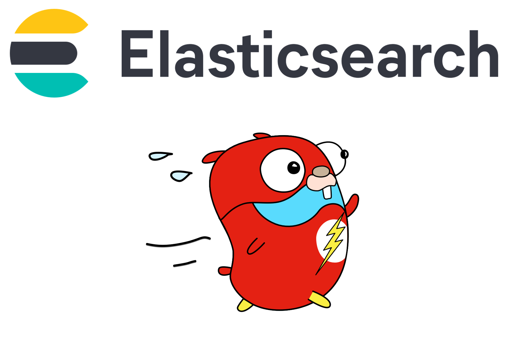

# Elasticsearch for Gophers

This project contains an end-to-end example that showcases different features from the official [Go Client for Elasticsearch](https://github.com/elastic/go-elasticsearch) that you can use as a reference about how to get started with Elasticsearch in your Go projects. It is not intended to provide the full spectrum of what the client is capable of — but it certainly puts you on the right track.



You can run this code with an Elasticsearch instance running locally, to which you can leverage the [Docker Compose code](./docker-compose.yml) available in the project. Alternatively, you can also run this code with an Elasticsearch instance from Elastic Cloud that can be easily created using the [Terraform code](./elastic-cloud.tf) also available in the project.

## Examples available in this project:

### 🚀 Movies Loading

The data model from this project is a collection of movies from the file [movies.json](./movies.json). This file will be [loaded](logic/movies.go) in memory and made available within the context, which the other functions will work with. Here is an example of a movie:

```json
{
    "year": 2012,
    "title": "The Avengers",
    "info": {
        "directors": [
            "Joss Whedon"
        ],
        "release_date": "2012-04-11T00:00:00Z",
        "rating": 8.2,
        "genres": [
            "Action",
            "Fantasy"
        ],
        "image_url": "http://ia.media-imdb.com/images/M/MV5BMTk2NTI1MTU4N15BMl5BanBnXkFtZTcwODg0OTY0Nw@@._V1_SX400_.jpg",
        "plot": "Nick Fury of S.H.I.E.L.D. assembles a team of superhumans to save the planet from Loki and his army.",
        "rank": 48,
        "running_time_secs": 8580,
        "actors": [
            "Robert Downey Jr.",
            "Chris Evans",
            "Scarlett Johansson"
        ]
    }
}
```

### 🚀 Connection Handling

Once the movies are loaded, the code will create a [connection](logic/connect.go) with Elasticsearch and make this connection available within the context as well.

```go
newClient, err := elasticsearch.NewClient(elasticsearch.Config{
	Addresses: []string{
		"http://localhost:9200",
	},
})
if err != nil {
	panic(err)
}
```

### 🚀 Document Indexing

All the movies will be [indexed](logic/index.go) in Elasticsearch. The example uses the Bulk API to index documents, which is the equivalent to this:

```json
POST movies/_bulk
{ "index" : { "_index" : "movies", "_id" : "1" } }
{ "Year" : "2012", "Title": "The Avengers" }
```

### 🚀 Document Lookup

An example of [document lookup](logic/lookup.go) is also available. Out of all movies loaded, an ID will be randomly selected, and the document associated with this ID will be looked up — just like you would do with:

```json
GET movies/_doc/<DOCUMENT_ID>
```

### 🚀 You Know, for Search

Obviously, this project couldn't leave behind an example of a search. The implemented [search](logic/search.go) look for all the best action movies from Keanu Reeves from 1995 to 2005. This search is the equivalent to:

```json
GET movies/_search
{
  "query": {
    "bool": {
      "must": {
        "match": {
          "Actors.en": "keanu reeves"
        }
      },
      "filter": [
        {
          "term": {
            "Genres.keyword": "Action"
          }
        },
        {"range": {
          "Rating": {
            "gte": 7.0
          }
        }},
        {"range": {
          "Year": {
            "gte": 1995,
            "lte": 2005
          }
        }}
      ]
    }
  }
}
```

### 🚀 Aggregation Analytics

Finally, the project also runs a very interesting [aggregation](logic/aggreg.go) to find out the top five genres and their respective movie counts. Just like you would do with:

```json
GET movies/_search
{
  "size": 0,
  "aggs": {
    "movieCountPerGenre": {
      "terms": {
        "field": "Genres.keyword",
        "size": 5
      }
    }
  }
}
```

# License

This project is licensed under the [Apache 2.0 License](./LICENSE).